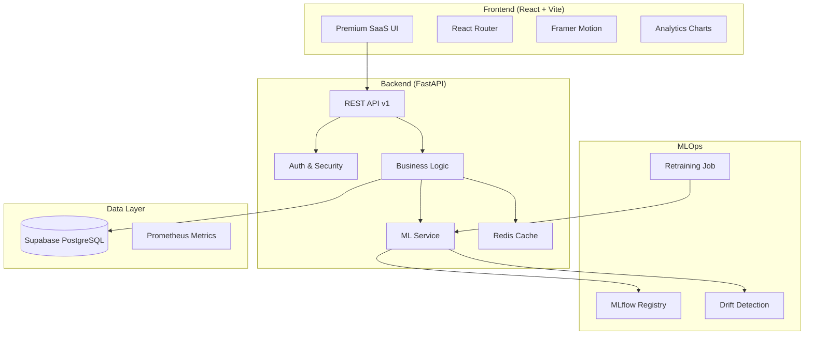

# 🎯 SentimentAI

<div align="center">


**A production-grade, real-time sentiment analysis platform with a stunning premium SaaS UI**

[Features](#-features) • [Quick Start](#-quick-start) • [Architecture](#-architecture) • [API Reference](#-api-reference) • [Development](#-development)

</div>

---

## ✨ Features

### 🧠 Machine Learning
- **5000+ Training Samples** with diverse vocabulary and templates
- **Binary + Neutral Classification** via confidence thresholds
- **Model Versioning** with MLflow Registry
- **Drift Detection** with Evidently
- **Automated Retraining** pipeline via APScheduler
- **Cross-Validation** for robust model evaluation

### 🚀 API Capabilities
- **Single Text Analysis** with confidence scores
- **Batch Processing** up to 100 texts per request
- **CSV File Upload** for bulk analysis
- **Export Functionality** (JSON/CSV)
- **RESTful API** with versioning (`/api/v1/`)
- **JWT Authentication** for secure access
- **Rate Limiting** (SlowAPI) to prevent abuse
- **Redis Caching** for high performance

### 🎨 Premium SaaS UI
- **Dynamic Typing Effect** - Animated hero text using react-type-animation
- **Framer Motion Animations** - Smooth page transitions and scroll effects
- **Mesh Gradient Backgrounds** - Beautiful animated color orbs
- **Glowing Buttons** - Shimmer effects and neon glow on hover
- **Glassmorphism Design** - Frosted glass cards and sidebar
- **Premium Typography** - Syne (display) + Outfit (body) fonts
- **Multi-Page Dashboard** - Home, Analyze, Analytics, Settings, About
- **Collapsible Sidebar** - Modern navigation with active states
- **Dark/Light Theme** - Stunning themes with smooth transitions

### 🔧 Production Ready
- **Supabase PostgreSQL** integration
- **SQLAlchemy ORM** with Alembic migrations
- **Structured Logging** with `python-json-logger`
- **Environment Configuration** via Pydantic Settings
- **Prometheus Metrics** via `prometheus-fastapi-instrumentator`
- **Health Check Endpoints** for monitoring
- **Input Sanitization** with Bleach

---

## 🖥️ UI Preview

### Hero Section
- Large **Syne** font headings with gradient text
- Typing animation: *"Understand the Emotions / Feelings / Sentiments..."*
- Browser-style demo card with live sentiment preview
- Glowing CTA buttons with shimmer effects

### Dashboard
- Quick stats overview with animated counters
- Recent activity feed
- Quick analysis form

### Features
- 6 feature cards with gradient icons
- Hover effects with glow and lift
- Trusted by section with tech logos

---

## 🏗️ Architecture



### Directory Structure

```
ai-mlops/
├── backend/
│   ├── app/
│   │   ├── core/           # Config, Database, Logging
│   │   ├── models/         # SQLAlchemy & Pydantic models
│   │   ├── routers/        # API endpoints
│   │   ├── services/       # Business logic
│   │   └── main.py         # Application entry point
│   ├── ml/
│   │   ├── data/           # Training datasets
│   │   ├── models/         # Trained model artifacts
│   │   ├── generate_data.py
│   │   └── train.py
│   ├── requirements.txt
│   └── .env.example
│
└── sentiment-frontend/
    ├── public/
    │   ├── logo.svg        # App logo
    │   └── favicon.svg     # Browser favicon
    ├── src/
    │   ├── components/     # Reusable UI components
    │   │   ├── Sidebar.jsx
    │   │   ├── Footer.jsx
    │   │   └── ...
    │   ├── pages/          # Route pages
    │   │   ├── HomePage.jsx
    │   │   ├── DashboardPage.jsx
    │   │   ├── AnalyzePage.jsx
    │   │   ├── AnalyticsPage.jsx
    │   │   ├── SettingsPage.jsx
    │   │   └── AboutPage.jsx
    │   ├── App.jsx
    │   └── index.css       # Premium design system
    ├── package.json
    └── .env.example
```

---

## 🔄 CI/CD Pipeline

### GitHub Actions
- **Backend CI**: Lint (Black/Flake8), Test (pytest), Build verification
- **Frontend CI**: ESLint, Production build

### Pre-commit Hooks
```bash
pip install pre-commit
pre-commit install
```

---

## 🧪 Testing

### Run Integration Tests
```bash
cd backend
pytest tests/ -v --cov=app
```

### Run Load Tests
```bash
locust -f tests/load/locustfile.py --host=http://localhost:8000
```

---

## ⚡ Background Tasks (Celery)

### Start Worker
```bash
celery -A app.tasks.celery_app worker --loglevel=info
```

### Start Scheduler
```bash
celery -A app.tasks.celery_app beat --loglevel=info
```

### Available Tasks
- `process_batch` - Async batch prediction
- `check_drift` - Daily drift detection
- `create_analytics_snapshot` - Hourly analytics
- `retrain_model` - On-demand retraining

---

## 📚 Documentation

- [Usage Instructions](./USAGE_INSTRUCTIONS.md) - Complete API usage guide
- [Deployment Runbook](./docs/runbooks/deployment.md)
- [Incident Response](./docs/runbooks/incident-response.md)
- [Model Retraining](./docs/runbooks/model-retraining.md)


---

## 🚀 Quick Start

### Prerequisites
- Python 3.9+
- Node.js 18+
- Supabase account (for PostgreSQL)

### 1. Backend Setup

```bash
# Navigate to backend
cd backend

# Create virtual environment
python -m venv venv
source venv/bin/activate  # On Windows: venv\Scripts\activate

# Install dependencies
pip install -r requirements.txt

# Configure environment
cp .env.example .env
# Edit .env with your Supabase credentials

# Generate training data
python -m ml.generate_data

# Train the model
python -m ml.train

# Start the server
uvicorn app.main:app --reload --port 8000
```

### 2. Frontend Setup

```bash
# Navigate to frontend
cd sentiment-frontend

# Install dependencies
npm install

# Configure environment
cp .env.example .env

# Start development server
npm run dev
```

### 3. Access the Application

- **Frontend**: http://localhost:5173
- **API Docs**: http://localhost:8000/docs
- **Health Check**: http://localhost:8000/api/v1/health

---

## 📦 Frontend Dependencies

| Package | Version | Purpose |
|---------|---------|---------|
| react | 19.x | UI Framework |
| react-router-dom | 7.x | Client-side routing |
| framer-motion | 11.x | Animations |
| react-type-animation | 3.x | Typing effect |
| axios | 1.x | HTTP client |
| lucide-react | 0.x | Icons |

---

## 📡 API Reference

### Base URL
```
http://localhost:8000/api/v1
```

### Endpoints

#### Predictions

| Method | Endpoint | Description |
|--------|----------|-------------|
| `POST` | `/predictions` | Analyze single text |
| `POST` | `/predictions/batch` | Analyze multiple texts |
| `POST` | `/predictions/upload` | Upload CSV for analysis |
| `GET` | `/predictions/export` | Export prediction history |
| `GET` | `/predictions/{id}` | Get specific prediction |

#### Statistics

| Method | Endpoint | Description |
|--------|----------|-------------|
| `GET` | `/stats` | Get basic statistics |
| `GET` | `/stats/analytics` | Get detailed analytics |
| `GET` | `/stats/trends` | Get trend data |
| `GET` | `/stats/words` | Get word frequency |

#### Health

| Method | Endpoint | Description |
|--------|----------|-------------|
| `GET` | `/health` | System health check |
| `GET` | `/health/model` | Model information |
| `GET` | `/health/ready` | Readiness probe |
| `GET` | `/health/live` | Liveness probe |

### Example Request

```bash
curl -X POST "http://localhost:8000/api/v1/predictions" \
  -H "Content-Type: application/json" \
  -d '{"text": "This product is absolutely amazing!"}'
```

### Example Response

```json
{
  "id": 1,
  "sentiment": "positive",
  "confidence": 0.94,
  "positive_score": 0.94,
  "negative_score": 0.06,
  "neutral_score": 0.0,
  "model_version": "v2.0",
  "processing_time_ms": 12.5,
  "timestamp": "2025-12-25T04:30:00Z"
}
```

---

## 📊 Model Training

### Generate Training Data

```bash
cd backend
python -m ml.generate_data
```

This generates 5000+ samples:
- 2500 positive samples
- 2000 negative samples
- 500 neutral samples

### Train the Model

```bash
python -m ml.train --model logistic_regression
```

Available models:
- `logistic_regression` (default, fastest)
- `random_forest` (higher accuracy)
- `svm` (best for small datasets)

---

## 🎨 Design System

### Typography
| Font | Usage |
|------|-------|
| **Syne** | Display headings |
| **Outfit** | Body text |
| **Fira Code** | Code snippets |

### Colors
- **Primary**: Purple gradient (#a855f7 → #ec4899)
- **Accent Cyan**: #00f5d4 (neon glow)
- **Success**: #10b981
- **Danger**: #f43f5e

### Effects
- Glassmorphism with backdrop blur
- Mesh gradient backgrounds
- Shimmer button animations
- Floating orb animations

---

## 📈 Performance

| Metric | Value |
|--------|-------|
| Single Prediction | ~10-15ms |
| Batch (100 texts) | ~500-800ms |
| Model Load Time | ~200ms |
| API Response (P95) | <50ms |

---

## 🔜 Roadmap

- [ ] Multi-language support
- [ ] Custom model training UI
- [ ] Real-time WebSocket updates
- [ ] User authentication
- [ ] Rate limiting middleware
- [ ] Kubernetes deployment

---

## 📄 License

MIT License - feel free to use this project for learning and production.

---

<div align="center">
  <p>Built with ❤️ using FastAPI, React, and Scikit-learn</p>
  <p><sub>Premium SaaS UI inspired by Linear & Vercel</sub></p>
</div>
